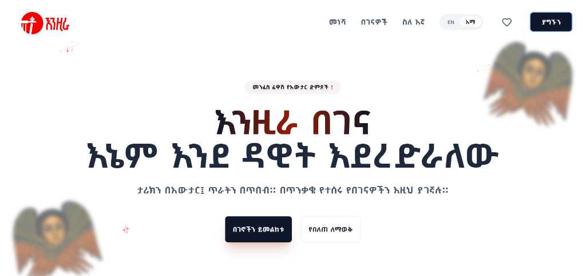
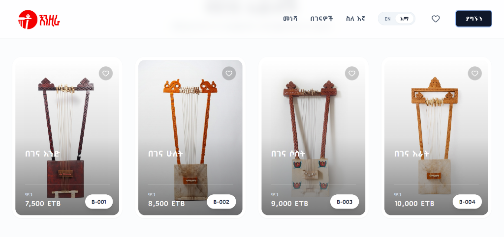
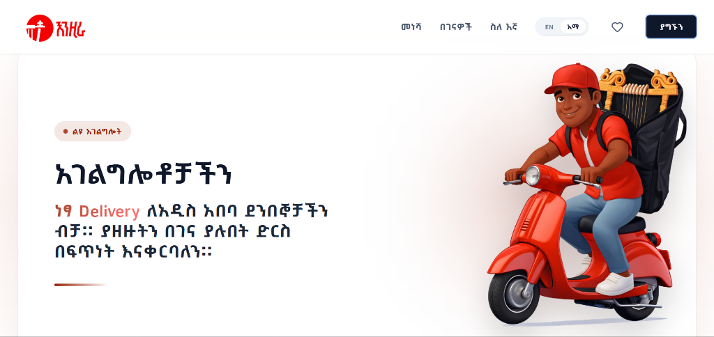

# Enzira Begena Shop (እንዚራ በገና)

Welcome to the **Enzira Begena Shop** website, a premium digital storefront for handcrafted Ethiopian Begena instruments. This application showcases the spiritual and historical significance of the Begena through a modern, responsive, and bilingual user interface.



## 🌟 Key Features

### 1. **Premium & Responsive Design**
   - A fully responsive layout that works seamlessly on desktop, tablet, and mobile devices.
   - Modern aesthetics with glassmorphism effects, smooth gradients, and premium typography.
   - Custom animations for a polished user experience.

### 2. **Bilingual Support (Amharic & English)**
   - **Default Amharic**: The site launches in Amharic, respecting the local context.
   - **One-Click Switch**: Users can instantly toggle between English and Amharic, with all content (navigation, products, details) translating dynamically.

### 3. **Interactive Product Gallery**
   - Beautiful grid display of available Begenas.
   - High-quality imagery with hover effects.
   - **Favorites System**: Users can add items to their wishlist, which persists via local storage.



### 4. **Detailed Product View & Dynamic Pricing**
   - Detailed modal view for each instrument.
   - **Package Options**: Users can choose to buy the Begena alone or with a carrying bag.
   - **Smart Pricing**: The price automatically updates based on the selection (e.g., adding +1,500 ETB or +2,000 ETB depending on the model).
   - **Direct Ordering**: "Order Now" button pre-fills a Telegram message with the specific product details for easy purchasing.

### 5. **Services Section**
   - dedicated section highlighting unique value propositions.
   - Featured "Free Delivery" service for Addis Ababa customers.



### 6. **Contact & Footer**
   - Quick access to contact information.
   - Smooth scrolling integration for "Contact Us" actions.

## 🛠️ Technology Stack

- **Frontend Framework**: [React](https://reactjs.org/)
- **Build Tool**: [Vite](https://vitejs.dev/)
- **Styling**: [Tailwind CSS](https://tailwindcss.com/)
- **Icons**: [Lucide React](https://lucide.dev/)
- **Font**: Google Fonts (Inter, Shiromeda, Geom)

## 🚀 Getting Started

To run this project locally, follow these steps:

1.  **Clone the repository**
    ```bash
    git clone https://github.com/natnaelkornima/Enzira_Begena.git
    cd Enzira_Begena
    ```

2.  **Install Dependencies**
    ```bash
    npm install
    ```

3.  **Run Development Server**
    ```bash
    npm run dev
    ```

4.  **Build for Production**
    ```bash
    npm run build
    ```

## 📂 Project Structure

The project has been refactored for scalability:

```
src/
├── components/         # UI and Feature components
│   ├── ui/             # Reusable UI elements (Button, Badge)
│   ├── Hero.jsx
│   ├── Gallery.jsx
│   ├── Services.jsx
│   ├── Navbar.jsx
│   └── ...
├── contexts/           # React Contexts (Language, Favorites)
├── data/               # Static data (translations, product lists)
└── App.jsx             # Main layout and provider setup
public/
├── images/             # Product and asset images
└── ...
```

---
© 2025 Enzira Begena Shop. All rights reserved.
