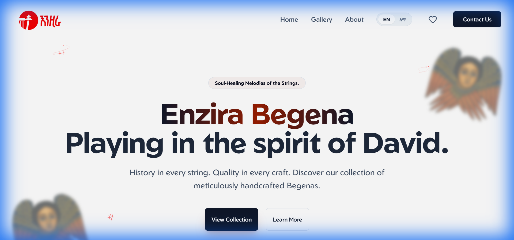

# 🎻 Enzira Begena Shop

A modern, professional e-commerce platform for **Begena** (Ethiopian Lyre) enthusiasts. Experience the divine sound with our curated selection of high-quality instruments, accessories, and learning resources.

[](https://enzira-begena-shop.netlify.app)



## ✨ Features

- **🌍 Multilingual Interface**: Seamlessly switch between **Amharic** and **English** for a personalized experience.
- **📱 Responsive Design**: Fully optimized for mobile, tablet, and desktop viewing.
- **🛒 Interactive Catalog**: Browse various Begena categories with detailed information and high-quality imagery.
- **❤️ Favorites System**: Save your preferred instruments to your personal wishlist with smooth animations.
- **🎨 Premium UI/UX**: Crafted with a focus on aesthetics, featuring modern scrollbars, glassmorphism effects, and intuitive navigation.
- **⚡ Fast & Secure**: Built on the latest web technologies for lightning-fast performance.

## 🛠️ Tech Stack

- **Framework**: [React 19](https://react.dev/)
- **Build Tool**: [Vite](https://vitejs.dev/)
- **Styling**: [Tailwind CSS](https://tailwindcss.com/)
- **Icons**: [Lucide React](https://lucide.dev/)
- **Deployment**: [Netlify](https://www.netlify.com/)

## 🚀 Getting Started

### Prerequisites

- [Node.js](https://nodejs.org/) (v18 or higher)
- [npm](https://www.npmjs.com/) or [yarn](https://yarnpkg.com/)

### Installation

1. **Clone the repository**:
   ```bash
   git clone https://github.com/natnaelkornima/Enzira_Begena.git
   cd "Enzira Begena Shop"
   ```

2. **Install dependencies**:
   ```bash
   npm install
   ```

3. **Start the development server**:
   ```bash
   npm run dev
   ```

4. **Open your browser**:
   Navigate to `http://localhost:5173` to see the application in action.

## 📦 Deployment

This project is configured for continuous deployment on **Netlify**.

- **Build Command**: `npm run build`
- **Publish Directory**: `dist`

Live URL: [https://enzira-begena-shop.netlify.app](https://enzira-begena-shop.netlify.app)

## 🤝 Contributing

Contributions are welcome! Please feel free to submit a Pull Request or open an issue for any enhancements or bug fixes.

## 📄 License

This project is licensed under the MIT License - see the [LICENSE](LICENSE) file for details.

---

*Crafting harmony through technology. Enzira Begena Shop.*
